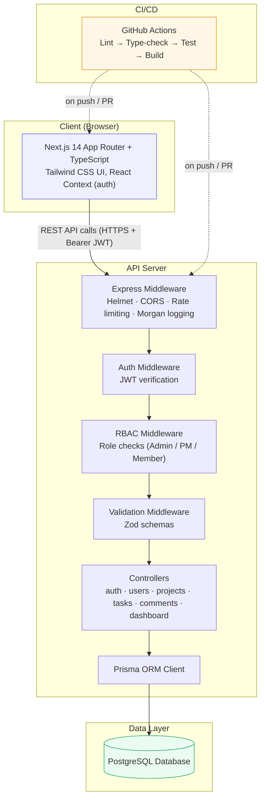

# System Architecture — TaskFlow

## Component overview

| Layer | Technology | Responsibility |
|---|---|---|
| Frontend | Next.js 14 (App Router), TypeScript, Tailwind CSS | Renders role-aware dashboards, project/task views, forms, and modals. Talks to the API over `fetch` using a JWT stored in `localStorage`. |
| API Server | Node.js, Express, TypeScript | Exposes a versioned-free REST API under `/api`. Applies security middleware (Helmet, CORS, rate limiting), authentication, RBAC, and request validation before reaching controllers. |
| ORM | Prisma | Type-safe query layer and schema/migration management for PostgreSQL. |
| Database | PostgreSQL | Stores users, projects, project membership, tasks, comments, and an activity log. |
| CI/CD | GitHub Actions | Runs lint, type-check, automated tests, and a production build for both the backend and frontend on every push/PR. |

## Request flow example — "Team member updates a task's status"

1. Browser sends `PATCH /api/tasks/:id` with `Authorization: Bearer <jwt>` and `{ "status": "IN_REVIEW" }`.
2. `authenticate` middleware verifies the JWT and attaches `{ sub, role, email }` to the request.
3. `validate(updateTaskSchema)` checks the request body shape.
4. `task.controller.updateTask` loads the task, confirms the caller is either the assignee or a
   manager (Admin / the project's PM), and restricts which fields a Team Member may change
   (status, description only).
5. Prisma persists the change and an `ActivityLog` row is written if the status changed.
6. The updated task is returned as JSON; the frontend updates its local state.
