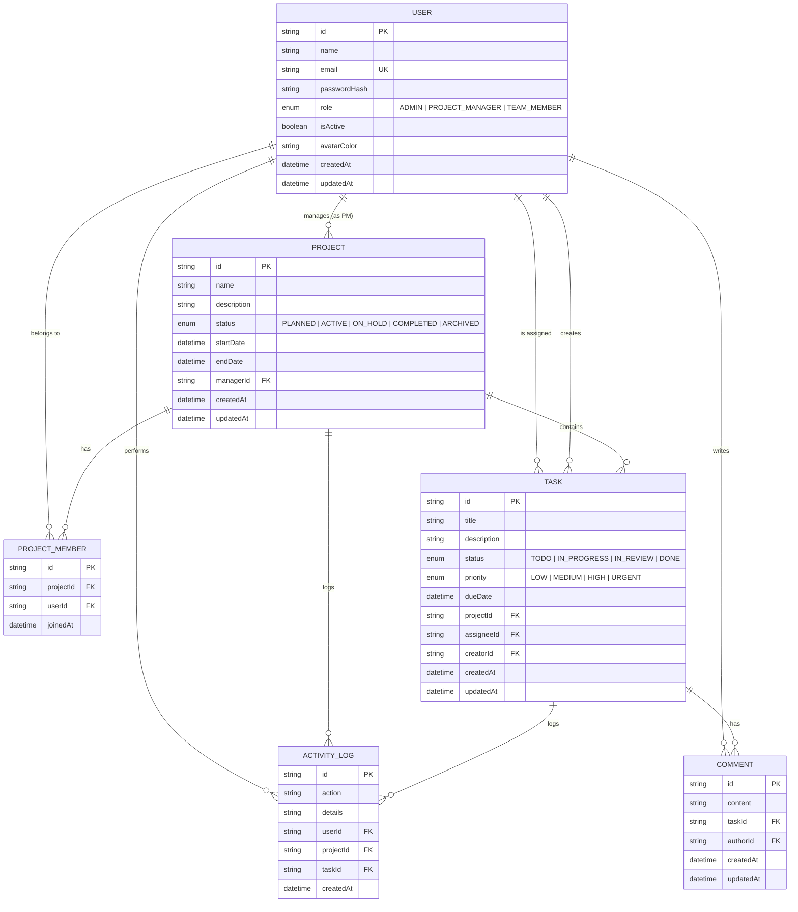

# Entity Relationship Diagram — TaskFlow

This reflects the Prisma schema at `backend/prisma/schema.prisma`. Paste the block below into
[mermaid.live](https://mermaid.live) or view it directly on GitHub (which renders Mermaid natively).

## Notes on the design

- **`PROJECT_MEMBER`** is a join table modelling the many-to-many relationship between `USER` and
  `PROJECT`, with a unique constraint on `(projectId, userId)` to prevent duplicate membership.
- **`PROJECT.managerId`** is a direct foreign key to `USER` — every project has exactly one
  Project Manager, enforced at the database level (`onDelete: Cascade`).
- **`TASK.assigneeId`** is nullable (`onDelete: SetNull`) — a task can be unassigned, and deleting
  a user does not delete their previously assigned tasks, just clears the assignment.
- **`ACTIVITY_LOG`** is an append-only audit trail used to power the "Recent activity" panel on the
  dashboard and can back an admin audit view.
- All foreign keys are indexed to keep common queries (tasks by project, tasks by assignee, etc.)
  efficient.
