# Use Case Diagram — TaskFlow

```mermaid
flowchart LR
    Admin([Administrator])
    PM([Project Manager])
    Member([Team Member])

    subgraph Auth["Authentication"]
        UC1((Register account))
        UC2((Log in / Log out))
    end

    subgraph UserMgmt["User Management"]
        UC3((Create user account))
        UC4((Change user role))
        UC5((Activate / deactivate user))
        UC6((Delete user))
    end

    subgraph ProjectMgmt["Project Management"]
        UC7((Create project))
        UC8((Update / delete project))
        UC9((Add / remove project members))
        UC10((View projects))
    end

    subgraph TaskMgmt["Task Management"]
        UC11((Create task))
        UC12((Assign task to member))
        UC13((Edit task details))
        UC14((Delete task))
        UC15((Update task status))
        UC16((Comment on task))
        UC17((View assigned tasks))
    end

    subgraph Dashboard["Reporting"]
        UC18((View role-scoped dashboard & activity feed))
    end

    Admin --> UC1
    Admin --> UC2
    Admin --> UC3
    Admin --> UC4
    Admin --> UC5
    Admin --> UC6
    Admin --> UC7
    Admin --> UC8
    Admin --> UC9
    Admin --> UC10
    Admin --> UC11
    Admin --> UC12
    Admin --> UC13
    Admin --> UC14
    Admin --> UC16
    Admin --> UC18

    PM --> UC2
    PM --> UC7
    PM --> UC8
    PM --> UC9
    PM --> UC10
    PM --> UC11
    PM --> UC12
    PM --> UC13
    PM --> UC14
    PM --> UC15
    PM --> UC16
    PM --> UC18

    Member --> UC1
    Member --> UC2
    Member --> UC10
    Member --> UC15
    Member --> UC16
    Member --> UC17
    Member --> UC18
```

## Use case summary

| Use case | Administrator | Project Manager | Team Member |
|---|:---:|:---:|:---:|
| Register / log in | ✅ | ✅ | ✅ |
| Create / manage user accounts, roles, access | ✅ | ❌ | ❌ |
| Create / edit / delete any project | ✅ | Own projects only | ❌ |
| Add / remove project members | ✅ | Own projects only | ❌ |
| Create / edit / delete tasks | ✅ | Within own projects | ❌ |
| Assign tasks to team members | ✅ | Within own projects | ❌ |
| View projects & tasks | All | Managed / member of | Assigned to them |
| Update task status & description | ✅ | ✅ | Own tasks only |
| Comment on tasks | ✅ | ✅ | On accessible tasks |
| View dashboard & activity feed | System-wide | Scoped to own projects | Scoped to own tasks |
